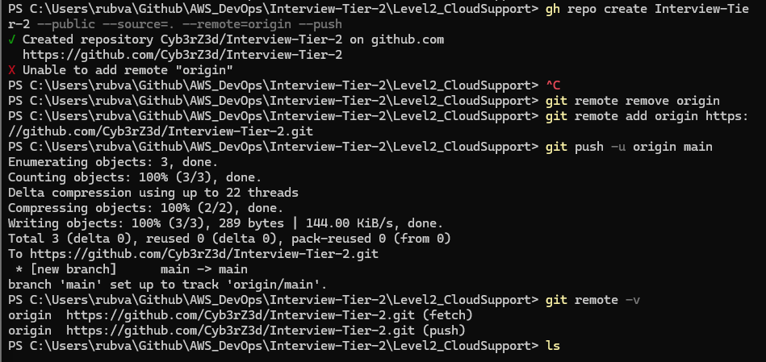

Title: Multi-Tier Web App Deployment & Support on AWS

Goal:
Demonstrate ability to deploy, configure, troubleshoot, and monitor a multi-tier application (web + database) on AWS using EC2, RDS, IAM, CloudWatch, and CLI tools. Show hands-on support skills like diagnosing connectivity, permissions, and logging issues.

Project Overview: 

- Deploy a Web Tier (EC2)
- Deploy a Database Tier (RDS MySQL)
- Configure Security Groups and IAM Roles
- Test & Troubleshoot App Connectivity
- Set up CloudWatch Alarms & Logs
- Document Common Support Issues + Fixes

  

# 1. Create Project Repository

- Completing notes in Github: `C:\Users\rubva\Github\AWS_DevOps\Interview-Tier-2\Level2_CloudSupport` and 

- New Github Repo Created:  `https://github.com/Cyb3rZ3d/Interview-Tier-2.git `

            git remote add origin https://github.com/<your-username>/aws-cloud-support-lab.git
            git add .
            git commit -m "Initial commit"
            git push -u origin main

    - Because of the error I received, the repo doesn't exist on GitHub, I needed to create the repo using Github CLI

            gh repo create Interview-Tier-2 --public --source=. --remote=origin --push

    - Encountered an error with the repo not being found, so I needed to remove the origin and re-add at.

            Remove old remote repo
            git remote remove origin
            
            Add corret remote repo URL
            git remote add origin https://github.com/Cyb3rZ3d/Interview-Tier-2.git
            
            Push main branch
            git push -u origin main
            
            Verify the repo is linked
            git remote -v

        

  

# 2. Deploy EC2 Web Server

- Go to EC2 > Launch Instances

        - Name: web-tier
        - AMI: Amazon Linux 2
        - Instance type: t3.micro
        - Key Pair: Existing Key "Alamo CyITS" 
        - Security Group: Allow HTTP (80) and SSH (22) Traffic from my network IP xx.xx.67.69/32
        - Launch instance

- SSH into EC2:

        ssh -i 'C:\Users\rubva\Documents\AWS Keys\Alamo_CyITS.pem' ec2-user@54.243.13.67

- Install Apache and Git

        sudo yum update -y
        sudo yum install httpd git -y
        sudo systemctl start httpd
        sudo systemctl enable httpd

- Deploy Static Website

        cd /var/www/html
        sudo git clone https://github.com/Cyb3rZ3d/Interview-Tier-2.git
        sudo cp -r https://github.com/Cyb3rZ3d/Interview-Tier-2.git/* .

    - Received error

            - (Powershell) 

            - (EC2) Pull Latest Changes on EC2 from the GitHub repo

                    cd /var/www/html/Interview-Tier-2

                    Mark the directory safe
                    sudo git config --global --add safe.directory /var/www/html/Interview-Tier-2

                    Pull the latest updates
                    git pull

                    Deploy website
                    echo "<h1>Cloud Support Project</h1>" | sudo tee index.html

- Deploy RDS MySQL

        AWS Console:
        - Create RDS MySQL DB
        - Public access: Yes
        - Security Group: allow inbound 3306 from EC2 SG
        - Save DB endpoint

    - Endpoint:  cloudsupport-db.cqz2ko88ajm7.us-east-1.rds.amazonaws.com
    - Pass:  XIqkpCE7jS3Bux9IOFdn
    - Port:  3306

    - Testing the endpoint

        - Amazon Linux 2023 no longer has MySQL as a package name.  Install as a client using a package name:

                sudo yum install -y mariadb105

- Connect Web to Database

        export DB_HOST=cloudsupport-db.cqz2ko88ajm7.us-east-1.rds.amazonaws.com
        export DB_USER=admin
        export DB_PASS=XIqkpCE7jS3Bux9IOFdn