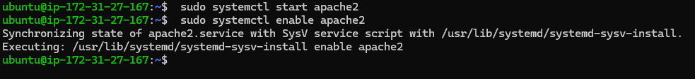

Ruben Valdez
July 17, 2025

The following is a training environment with learning AWS DevOps.

# Project 1:    Deploying a Static Website from GitHub to AWS EC2

  

# Create the EC2 Instance @ EC2 > Launch Instance: 

- Name:  Project-1_WebServer
- Amazon Machine Image (AMI):   Ubuntu Server 24.04 LTS (Free Tier eligible) 64-Bit
- Instance Type:    t3.small
- Key Pair name:    Alamo_CyITS
- Network Settings:  
    - Security Group: Anywhere 70.120.67.69/32 (Used IP Chicken to acquire the network IP.  "/32" means only this exact IP can connect to SSH.)
        - Allow SSH
        - Allow HTTP

  

# Update the downloaded AWS PEM key and SSH into the instance:

1. Navigated to the directory where the PEM file was placed `AWS Keys` and change permissions to only be read by me.

        icacls "Alamo_CyITS.pem" /inheritance:r

        icacls "Alamo_CyITS.pem" /grant:r "$($env:USERNAME):(R)"

    

2. SSH into EC2 instance `Project-1_WebServer`

        ssh -i Alamo_CyITS.pem ubuntu@98.81.173.104

        

3. Start initial OS update and upgrade, and install apache2:

        sudo apt update && upgrade -y
        sudo apt install apache2 -y
        sudo systemctl start apache2
        sudo systemctl enable apache2
    
    

# Create and Push the static website to GitHub

1. Create a folder for your website:

        mkdir my-static-site
        cd my-static-site

2. Create and Add a simple index.html

        nano index.html

    - Apply the following in the file:

            <!-- index.html -->
            <!DOCTYPE html>
            <html>
            <head><title>Hello DevOps</title></head>
            <body>
            <h1>Hello from EC2 + Apache!</h1>
            </body>
            </html>

3. Initialize Git and push to GitHub

        git init
        git add .
        git commit -m "My static site"
        gh repo create my-static-site --public --source=. --remote=origin --push

      

